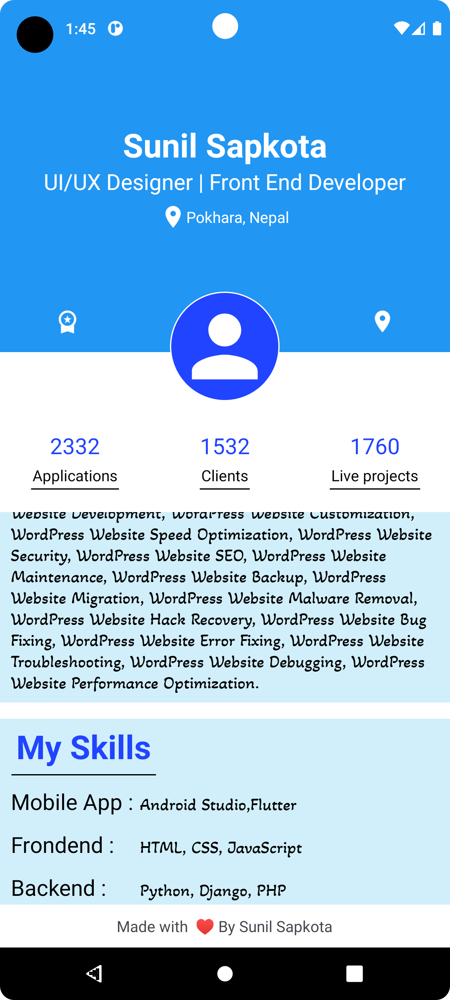

# Personal Portfolio App

Welcome to the Personal Portfolio App, a basic-level Android application built using Android Studio. This app serves as a platform for developers to showcase their professional portfolios, including information about their clients, projects, and more.

## Features

- Display a summary of the developer's portfolio.
- Showcase the number of clients the developer has worked with.
- Highlight the number of projects the developer has successfully completed.
- Provide contact information for potential clients and collaborators.
- Elegant and user-friendly interface for easy navigation.

## Screenshots
<div align="center">
  
  
</div>


## Installation

1. Clone this repository to your local machine using:

   ```
   git clone https://github.com/your-username/personal-portfolio-app.git
   ```

2. Open the project in Android Studio.

3. Build and run the app on an Android emulator or a physical device.

## Usage

1. Upon opening the app, you will be greeted with the home screen showcasing key statistics about the developer's portfolio.

2. Navigate to the "Portfolio" section to see a detailed list of projects and clients the developer has worked with.

3. Feel free to explore each project to learn more about its details and technologies used.

4. The "Contact" section provides information on how to get in touch with the developer for potential collaborations.

## Contributing

Contributions are welcome! If you find any issues or would like to enhance the app's functionality, follow these steps:

1. Fork the repository.

2. Create a new branch for your feature/fix:

   ```
   git checkout -b feature-new-feature
   ```

3. Make your changes and commit them:

   ```
   git commit -am 'Add new feature'
   ```

4. Push the changes to your branch:

   ```
   git push origin feature-new-feature
   ```

5. Create a pull request detailing your changes.

## License

This project is licensed under the [MIT License](LICENSE).

## Contact

For inquiries, you can reach out to the developer at:

- Email: me@sapkotasunil.com.np
- LinkedIn: [Developer's LinkedIn Profile](https://www.linkedin.com/in/sunilsapkota09/)
- Twitter: [@sunilsapkota09](https://twitter.com/sunilsapkota09)

Feel free to connect!
